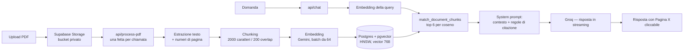

# ChatPDF — Chatta con i tuoi PDF, con citazioni a livello di pagina

Un'applicazione RAG full-stack: carichi un PDF, viene analizzato pagina per pagina, suddiviso in
chunk, vettorializzato e salvato in Postgres con `pgvector`; poi fai domande in linguaggio
naturale e ricevi una risposta in streaming che **cita la pagina esatta da cui proviene** —
clicchi la citazione e il viewer scorre fino a quella pagina evidenziandola.

Costruito con Next.js 16 (App Router), TypeScript, Supabase e il Vercel AI SDK.

> **Demo live:** **https://chatpdf-jade.vercel.app/**
> **Account di prova:** `example@example.it` · `example`

---

## Funzionalità

| | |
|---|---|
| **Retrieval-Augmented Generation** | Ricerca per similarità coseno sui chunk del documento; al modello arriva solo il contesto recuperato. |
| **Citazioni verificabili** | Il system prompt impone marcatori `[Pagina X]` costruiti dal `page_number` di ogni chunk. La UI li estrae dal Markdown in streaming e li rende come pulsanti collegati al viewer. |
| **Risposte ancorate al documento** | In assenza di contesto recuperato il prompt passa a una variante che istruisce il modello a dichiarare che il documento non tratta l'argomento. Le pagine assenti dal contesto non possono essere citate. |
| **Chat in streaming** | Streaming token per token, con rendering di Markdown, tabelle GitHub-flavored e LaTeX (KaTeX). |
| **Ingestion riprendibile** | I PDF lunghi vengono indicizzati a fette su più invocazioni, così l'ingestion non raggiunge mai il limite di tempo serverless e riprende esattamente da dove si era fermata. |
| **Auth e ownership** | Supabase Auth (email/password), RLS su Postgres, bucket Storage privato, signed URL a scadenza breve. |
| **Rate limiting per utente** | Contatori atomici su Postgres per singola route, con risposta `429` e `Retry-After`. |
| **BYOK** | L'utente può fornire dalla UI la propria API key di generazione; resta nel browser e viene passata a ogni richiesta, sovrascrivendo il default del server. |
| **UI bilingue** | Inglese e italiano, guidata da cookie e renderizzata lato server — la lingua della risposta e l'etichetta della citazione seguono il locale della UI. |

---

## Architettura



### Parametri della pipeline

| | |
|---|---|
| Chunking | `RecursiveCharacterTextSplitter`, 2000 caratteri con 200 di overlap (≈500 token), applicato **per pagina** così che `page_number` non venga mai perso attraverso il confine di un chunk |
| Embedding | `gemini-embedding-001`, `outputDimensionality: 768`, `RETRIEVAL_DOCUMENT` in indicizzazione e `RETRIEVAL_QUERY` in ricerca |
| Vector store | Colonna `vector(768)`, indice HNSW con `vector_cosine_ops` |
| Retrieval | Top 6 chunk, similarità restituita come `1 - (embedding <=> query)` |
| Generazione | Groq, `temperature: 0.2`, ultimi 10 messaggi della conversazione mantenuti nella richiesta |
| Fetta di ingestion | 128 chunk vettorializzati e salvati per invocazione, sotto `maxDuration = 60` |

---

## Decisioni di progettazione

**Riprendibilità senza coda.**
`/api/process-pdf` gestisce una fetta per chiamata e il client cicla finché la risposta non
dice `done`. L'offset di ripresa non è tracciato da nessuna parte: un PDF è immutabile, quindi
ri-derivare la lista dei chunk è deterministico e produce ogni volta la stessa lista nello
stesso ordine — il che rende `count(chunks where document_id = …)` l'offset esatto da cui
riprendere. Nessuna colonna cursore, nessuna tabella dei job, nessuna coda esterna per un
carico che non la giustifica ancora. L'insert è un `upsert` con `ignoreDuplicates` su
`(document_id, chunk_index)`, così una chiamata che muore dopo la scrittura ma prima della
risposta è innocua: il retry ri-deriva le stesse righe e le salta.

**Due interfacce, un solo punto che conosce il provider.**
`TextGenerator` ed `EmbeddingProvider` sono gli unici contratti che il resto dell'app vede.
Fuori da `src/lib/ai/` nessun file importa l'SDK di un provider né nomina un modello — gli id
dei modelli e le dimensioni dei vettori arrivano da `env.ts`, perché devono restare allineati
alla colonna `vector(768)` e alla firma della RPC. È ciò che ha reso BYOK un parametro
(`getTextGenerator(apiKey)`) invece di un refactor. L'astrazione esiste per due casi concreti
già sul tavolo — BYOK e il cambio del modello di embedding — non per simmetria.

**BYOK vale solo per la generazione.**
La chiave dell'utente sovrascrive il provider di generazione, mai quello di embedding: mandare
una chiave Groq a Gemini fallirebbe, e gli embedding devono restare coerenti con i vettori già
indicizzati perché la ricerca abbia senso. L'ingestion, di conseguenza, non accetta mai una
chiave dal client.

**Factory, mai singleton a livello di modulo.**
I client Supabase portano i cookie di sessione. Un client costruito a livello di modulo e
condiviso tra richieste servirà i dati di un utente a un altro su un'istanza serverless calda,
quindi ogni client e adapter proviene da una factory che ritorna una nuova istanza a ogni
chiamata.

**L'autorizzazione è applicata su tre livelli, deliberatamente.**
Il middleware redirige le richieste di pagina non autenticate — ottimistico, puramente per la
UX. Le API Route fanno il controllo vero, restringendo ogni lookup all'utente della sessione.
Le policy RLS limitano le letture alle righe possedute da `auth.uid()`. Poiché la ricerca
vettoriale gira sotto il service role, che aggira l'RLS, `match_document_chunks` riceve l'id
utente come **parametro esplicito** e fa join su `documents` per verificare la proprietà:
affidarsi lì ad `auth.uid()` significherebbe valutare silenziosamente a null e non filtrare
nulla.

**I path dello Storage sono la prova di proprietà.**
Gli oggetti vivono in `{user_id}/{file}`, e le policy dello Storage confrontano il primo
segmento del path con `auth.uid()`. `POST /api/documents` rifiuta ogni `storagePath` che non
inizi con l'id del chiamante — senza quel controllo un client potrebbe registrare una riga che
punta al file di qualcun altro. Il bucket è privato; il viewer riceve un signed URL di 2 ore
generato lato server.

**Il rate limiting è atomico, e fallisce in modo permissivo.**
Incremento e rotazione della finestra avvengono dentro un unico `INSERT … ON CONFLICT DO
UPDATE`, perché due lambda Vercel concorrenti che leggono un contatore e lo riscrivono
conterebbero entrambe in difetto. Se la RPC stessa va in errore, la richiesta viene permessa e
il fallimento loggato: il limiter mette un tetto alla spesa AI, non protegge dati, e non deve
mai essere il motivo per cui l'app è giù.

**I fallimenti dei provider vengono classificati, non appiattiti in un 500.**
L'AI SDK avvolge l'`APICallError` originale dentro catene di `RetryError` e `cause`, quindi il
classificatore le srotola ricorsivamente, poi distingue quota esaurita / rate limit / chiave
rifiutata a partire dagli status code e dagli indizi nel body della risposta. Ognuno mappa a un
messaggio utente e a uno status code distinti (`401` vs `429`). Un provider sotto rate limit non
deve leggersi come un'app rotta — soprattutto in BYOK, dove la colpa è di solito della chiave
dell'utente stesso.

**Un rate limit non marca un documento come fallito.**
Su `429` l'ingestion si ferma ma il documento resta in `processing` e l'errore non viene
persistito: il lavoro è riprendibile, quindi scrivere `error` nel database direbbe a chiunque
riapra la pagina che una pausa recuperabile è stata un fallimento. Ogni altro errore viene
persistito — anche lato client, via `PATCH`, per coprire il caso in cui la richiesta non abbia
mai raggiunto il server.

**Il parsing delle citazioni tollera i locale.**
La regex riconosce tutte le etichette note (`Page` / `Pagina`) e le forme multi-pagina
(`[Page 3, 5]`, `[Pagina 3 e 5]`), non solo quelle del locale attivo — una conversazione salvata
può contenere risposte generate prima che l'utente cambiasse lingua. Etichette e pattern vivono
in un unico modulo condiviso tra il costruttore del prompt e il renderer, così il formato che il
modello riceve l'ordine di emettere e il formato che la UI sa parsare non possono divergere.

---

## Problemi risolti

**`pdfjs` non gira su una lambda Vercel così com'è.** Due fallimenti che compaiono solo in
produzione:

- `ReferenceError: DOMMatrix is not defined` — `pdfjs-dist` chiama `new DOMMatrix()` durante la
  *valutazione del modulo*, prendendo la classe dalla dipendenza nativa opzionale
  `@napi-rs/canvas`, che sulla lambda non è installata. Poiché viene estratto solo testo e non
  si renderizza mai nulla su un canvas, la soluzione è un sostituto minimo di matrice 2D
  installato su `globalThis` prima che `pdf-parse` venga importato — e l'import deve essere
  dinamico, perché uno statico valuterebbe il modulo troppo tardi per servire a qualcosa.
- `Setting up fake worker failed` — `pdfjs` carica il proprio worker attraverso un `import()`
  costruito a runtime, un percorso che il file tracing di Vercel non riesce a seguire, quindi il
  worker non finisce mai nel bundle. Risolto importando il worker da un path letterale e
  pre-popolando `globalThis.pdfjsWorker`, più `serverExternalPackages: ["pdf-parse",
  "pdfjs-dist"]` per impedire al bundler di inghiottire il file del worker.

**I PDF grandi sforavano `maxDuration`.** Scaricare, parsare, vettorializzare e salvare un
documento da 200 pagine in una sola richiesta non sta in 60s — e la modalità di fallimento era
la peggiore: lavoro parziale, nessun progresso, tutto da rifare al retry. La suddivisione in
fette riprendibili ha eliminato sia il timeout sia il lavoro sprecato.

**Le chiamate ripetute erano banda e CPU gratis.** Ogni invocazione di una fetta riscarica e
ri-parsa il PDF, anche quando non resta nulla da vettorializzare, quindi un client che cicla
sull'endpoint è un vettore di amplificazione a basso costo. Il `429` viene restituito *prima*
che il lavoro inizi e fuori dal `try`, così il documento resta intatto in `processing` e
l'ingestion riprende comunque in modo pulito.

**I limiti di upload lato client non erano limiti.** Il tetto di 10 MB e la regola solo-PDF
esistevano unicamente nella dropzone — chiamare direttamente `supabase.storage.upload()` con la
anon key li aggirava entrambi. La migrazione `0005` imposta `file_size_limit` e
`allowed_mime_types` sul bucket stesso, così la regola è applicata dove non può essere saltata.

**Driver di ingestion concorrenti sullo stesso documento.** Effetti React rieseguiti più un
retry manuale potevano avviare due loop insieme. Protetto con una ref, più una seconda ref per
una cancellazione pulita allo unmount, così il loop si ferma dopo la fetta corrente invece che a
metà scrittura.

**Il viewer si strozzava sui documenti lunghi.** Montare tutte le pagine insieme è inutilizzabile
oltre qualche decina di pagine, quindi solo una finestra di pagine attorno a quella corrente
viene realmente renderizzata mentre le altre restano placeholder con l'aspect ratio corretto. La
pagina corrente è tracciata con un `IntersectionObserver` che sceglie il rapporto visibile più
alto, e l'observer viene attaccato per nodo al mount così che le pagine rimontate da `react-pdf`
continuino a essere osservate. L'oggetto `options` passato a `<Document>` è memoizzato — una
nuova identità fa ricaricare a `react-pdf` l'intero file.

**Il worker del PDF veniva resettato.** `pdfjs.GlobalWorkerOptions.workerSrc` va impostato nello
stesso modulo che renderizza `<Document>`; configurato altrove, l'ordine di valutazione dei
moduli ripristina il default e il viewer ripiega silenziosamente.

---

## Limiti noti

- **Solo PDF testuali.** I documenti scansionati non producono testo estraibile; vengono
  rilevati e rifiutati con un messaggio esplicito invece di essere indicizzati come vuoti. L'OCR
  è il passo successivo.
- **L'ingestion è guidata dal browser.** Il loop sulle fette vive nella pagina, quindi chiudere
  la tab mette in pausa l'indicizzazione — riprende alla riapertura, ma un completamento non
  presidiato richiede un worker con coda (o le background function di Vercel), che è la vera
  soluzione al tetto dei 60s.
- **Tetto di upload 10 MB / solo PDF**, e il valore è duplicato nella dropzone e nella
  configurazione del bucket; vanno tenuti allineati a mano.
- **Il retrieval è una semplice similarità coseno top-6.** Nessun reranking, nessuna ricerca
  ibrida keyword/vettoriale, nessuna riscrittura della query — su documenti lunghi o ripetitivi
  un passaggio di reranking con cross-encoder migliorerebbe misurabilmente la precisione.
- **Gli embedding sono troncati a 768 dimensioni.** `gemini-embedding-001` ne produce
  nativamente 3072; 768 mantengono l'indice piccolo ed economico a un certo costo in qualità di
  retrieval. Cambiarlo significa cambiare insieme la colonna, l'indice HNSW e la firma della
  RPC, e re-indicizzare tutto.
- **La memoria della conversazione è una finestra di 10 messaggi** senza summarization, e viene
  vettorializzato solo l'*ultimo* messaggio utente — un follow-up tipo "e il precedente?" cerca
  con una query sotto-specificata.
- **Nessuna suite di test automatici, per ora.** La pipeline di ingestion è stata divisa in step
  discreti e senza rete proprio perché chunking e mappatura delle pagine possano essere testati
  senza un provider.

---

## Stack tecnologico

- **Framework:** Next.js 16 (App Router, Server Component), TypeScript, Tailwind CSS v4
- **Database e storage:** Supabase — Postgres + `pgvector`, Storage, Auth, policy RLS
- **AI:** Vercel AI SDK per lo streaming · Groq per la generazione · Google Gemini per gli
  embedding
- **Elaborazione dei documenti:** `pdf-parse` / `pdfjs-dist` per l'estrazione consapevole delle
  pagine, `RecursiveCharacterTextSplitter` di LangChain per il chunking
- **UI:** `react-pdf`, `react-dropzone`, `react-markdown` + `remark-gfm` + KaTeX
- **Validazione:** schemi `zod` a ogni confine delle API
- **Deploy:** Vercel, runtime Node per le route che usano LangChain e il service role

---

## Esecuzione in locale

```bash
npm install
```

```bash
cp .env.example .env.local
```

Compila `.env.local`:

| Variabile | Dove trovarla |
|---|---|
| `NEXT_PUBLIC_SUPABASE_URL`, `NEXT_PUBLIC_SUPABASE_ANON_KEY` | Supabase → Project Settings → API |
| `SUPABASE_SERVICE_ROLE_KEY` | Stessa pagina — **solo server-side**, mai esposta al client |
| `GROQ_API_KEY` | Provider di generazione |
| `GOOGLE_GENERATIVE_AI_API_KEY` | Provider di embedding |

Poi esegui i file SQL in `supabase/migrations/` **in ordine** dall'SQL Editor di Supabase.
Creano l'estensione `vector`, le tabelle `documents` e `document_chunks`, l'indice HNSW, le
funzioni `match_document_chunks` e `consume_rate_limit`, le policy RLS e il bucket privato
`pdfs` con i suoi vincoli di dimensione e MIME.

```bash
npm run dev
```

L'app gira su `http://localhost:3000`. `env.ts` solleva un errore esplicito quando manca una
variabile richiesta, così una configurazione sbagliata fallisce all'avvio invece che a metà
richiesta.
