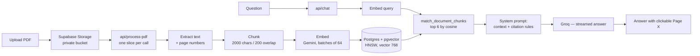

# ChatPDF — Chat with your PDFs, with page-level citations

A full-stack RAG application: upload a PDF, it gets parsed page by page, chunked, embedded and
stored in Postgres with `pgvector`; then you ask questions in natural language and get a
streamed answer that **cites the exact page it came from** — click the citation and the viewer
scrolls to that page and highlights it.

Built with Next.js 16 (App Router), TypeScript, Supabase and the Vercel AI SDK.

> **Live demo:** **https://chatpdf-jade.vercel.app/**
> **Demo account:** `example@exampe.it` · `example`

---

## Features

| | |
|---|---|
| **Retrieval-Augmented Generation** | Cosine similarity search over the document's chunks; only the retrieved context reaches the model. |
| **Verifiable citations** | The system prompt forces `[Page X]` markers built from each chunk's `page_number`. The UI parses them out of the streamed Markdown and renders them as buttons wired to the viewer. |
| **Grounded answers** | With no retrieved context the prompt switches to a variant that instructs the model to say the document doesn't cover it. Pages absent from the context can't be cited. |
| **Streaming chat** | Token-by-token streaming, with Markdown, GitHub-flavored tables and LaTeX (KaTeX) rendering. |
| **Resumable ingestion** | Long PDFs are indexed in slices across multiple invocations, so ingestion never hits the serverless time limit and resumes exactly where it stopped. |
| **Auth + ownership** | Supabase Auth (email/password), Postgres RLS, private Storage bucket, short-lived signed URLs. |
| **Per-user rate limiting** | Atomic Postgres counters per route, returning `429` with `Retry-After`. |
| **BYOK** | Users can supply their own generation API key from the UI; it stays in the browser and is passed per request, overriding the server default. |
| **Bilingual UI** | English and Italian, cookie-driven and server-rendered — the answer language and the citation label follow the UI locale. |

---

## Architecture



### Pipeline parameters

| | |
|---|---|
| Chunking | `RecursiveCharacterTextSplitter`, 2000 chars with 200 overlap (≈500 tokens), applied **per page** so `page_number` is never lost across a chunk boundary |
| Embeddings | `gemini-embedding-001`, `outputDimensionality: 768`, `RETRIEVAL_DOCUMENT` when indexing and `RETRIEVAL_QUERY` when searching |
| Vector store | `vector(768)` column, HNSW index with `vector_cosine_ops` |
| Retrieval | top 6 chunks, similarity returned as `1 - (embedding <=> query)` |
| Generation | Groq, `temperature: 0.2`, last 10 conversation messages kept in the request |
| Ingestion slice | 128 chunks embedded and persisted per invocation, under `maxDuration = 60` |

---

## Design decisions

**Resumability without a queue.**
`/api/process-pdf` handles one slice per call and the client loops until the response says
`done`. The resume offset isn't tracked anywhere: a PDF is immutable, so re-deriving the chunk
list is deterministic and produces the same list in the same order every time — which makes
`count(chunks where document_id = …)` the exact offset to resume from. No cursor column, no job
table, no external queue for a workload that doesn't yet justify one. The insert is an
`upsert` with `ignoreDuplicates` on `(document_id, chunk_index)`, so a call that dies after
writing but before responding is harmless: the retry re-derives the same rows and skips them.

**Two interfaces, one place that knows the provider.**
`TextGenerator` and `EmbeddingProvider` are the only contracts the rest of the app sees.
Outside `src/lib/ai/`, no file imports a provider SDK or names a model — model ids and vector
dimensions come from `env.ts`, because they have to stay aligned with the `vector(768)` column
and the RPC signature. That's what made BYOK a parameter (`getTextGenerator(apiKey)`) instead
of a refactor. The abstraction exists for two concrete cases already on the table — BYOK and
swapping the embedding model — not for symmetry.

**BYOK applies to generation only.**
The user's key overrides the generation provider, never the embedding one: sending a Groq key
to Gemini would fail, and embeddings must stay consistent with the vectors already indexed for
the search to mean anything. Ingestion therefore never accepts a key from the client at all.

**Factories, never module-level singletons.**
Supabase clients carry session cookies. A client built at module scope and shared across
requests will serve one user's data to another on a warm serverless instance, so every client
and adapter comes from a factory returning a fresh instance per call.

**Authorization is enforced at three layers, deliberately.**
Middleware redirects unauthenticated page requests — optimistic, purely for UX. API routes do
the real check by scoping every lookup to the session user. RLS policies restrict reads to
rows owned by `auth.uid()`. Because the vector search runs under the service role, which
bypasses RLS, `match_document_chunks` takes the user id as an **explicit parameter** and joins
`documents` to verify ownership: relying on `auth.uid()` there would silently evaluate to null
and filter nothing.

**Storage paths are the ownership proof.**
Objects live at `{user_id}/{file}`, and the Storage policies compare the first path segment to
`auth.uid()`. `POST /api/documents` rejects any `storagePath` that doesn't start with the
caller's id — without that check a client could register a row pointing at someone else's file.
The bucket is private; the viewer gets a 2-hour signed URL minted server-side.

**Rate limiting is atomic, and fails open.**
Increment and window rotation happen inside a single `INSERT … ON CONFLICT DO UPDATE`, because
two concurrent Vercel lambdas reading a counter and writing it back would both undercount. If
the RPC itself errors, the request is allowed and the failure is logged: the limiter caps AI
spend, it doesn't guard data, and it must never be the reason the app is down.

**Provider failures are classified, not flattened into a 500.**
The AI SDK wraps the original `APICallError` inside `RetryError` and `cause` chains, so the
classifier unwraps recursively, then distinguishes quota exhausted / rate-limited / key
rejected from status codes and response-body hints. Each maps to a distinct user-facing message
and status code (`401` vs `429`). A rate-limited provider must not read as a broken app —
especially in BYOK, where the fault is usually the user's own key.

**A rate limit doesn't mark a document as failed.**
On `429`, ingestion stops but the document stays `processing` and the error is not persisted:
the work is resumable, so writing `error` to the database would tell anyone reopening the page
that a recoverable pause was a failure. Any other error is persisted — including client-side,
via a `PATCH`, to cover the case where the request never reached the server.

**Citation parsing is locale-tolerant.**
The regex recognises every known label (`Page` / `Pagina`) and multi-page forms
(`[Page 3, 5]`, `[Pagina 3 e 5]`), not just the active locale's — a saved conversation can
contain answers generated before the user switched language. Labels and pattern live in one
module shared by the prompt builder and the renderer, so the format the model is told to emit
and the format the UI can parse cannot drift apart.

---

## Problems solved

**`pdfjs` doesn't run on a Vercel lambda out of the box.** Two failures that only appear in
production:

- `ReferenceError: DOMMatrix is not defined` — `pdfjs-dist` calls `new DOMMatrix()` during
  *module evaluation*, taking the class from the optional native dependency `@napi-rs/canvas`,
  which isn't installed on the lambda. Since only text is extracted and nothing is ever
  rendered to a canvas, the fix is a minimal 2D-matrix stand-in installed on `globalThis`
  before `pdf-parse` is imported — and the import must be dynamic, because a static one would
  evaluate the module too late to matter.
- `Setting up fake worker failed` — `pdfjs` loads its worker through an `import()` built at
  runtime, a path Vercel's file tracing can't follow, so the worker never makes it into the
  bundle. Fixed by importing the worker from a literal path and pre-populating
  `globalThis.pdfjsWorker`, plus `serverExternalPackages: ["pdf-parse", "pdfjs-dist"]` to keep
  the bundler from swallowing the worker file.

**Large PDFs blew past `maxDuration`.** Downloading, parsing, embedding and persisting a
200-page document in one request doesn't fit in 60s — and the failure mode was the worst kind:
partial work, no progress, back to zero on retry. Splitting into resumable slices removed both
the timeout and the wasted work.

**Repeated calls were free bandwidth and CPU.** Every slice invocation re-downloads and
re-parses the PDF, even when there's nothing left to embed, so a client looping on the endpoint
is a cheap amplification vector. The `429` is returned *before* the work starts and outside the
`try`, so the document is left untouched in `processing` and ingestion still resumes cleanly.

**Client-side upload limits weren't limits.** The 10 MB cap and PDF-only rule existed only in
the dropzone — calling `supabase.storage.upload()` directly with the anon key bypassed both.
Migration `0005` sets `file_size_limit` and `allowed_mime_types` on the bucket itself, so the
rule is enforced where it can't be skipped.

**Concurrent ingestion drivers on the same document.** React effects re-running plus a manual
retry could start two loops at once. Guarded by a ref, with a second ref for clean cancellation
on unmount so the loop stops after the current slice rather than mid-write.

**The viewer choked on long documents.** Mounting every page at once is unusable past a few
dozen pages, so only a window of pages around the current one is really rendered while the rest
stay aspect-ratio placeholders. The current page is tracked with an `IntersectionObserver`
picking the highest visible ratio, and the observer is attached per node on mount so pages
remounted by `react-pdf` keep being observed. The `options` object passed to `<Document>` is
memoised — a fresh identity makes `react-pdf` reload the whole file.

**The PDF worker was being reset.** `pdfjs.GlobalWorkerOptions.workerSrc` has to be set in the
same module that renders `<Document>`; configured elsewhere, module evaluation order restores
the default and the viewer silently falls back.

---

## Known limits

- **Text-based PDFs only.** Scanned documents produce no extractable text; they're detected and
  rejected with an explicit message rather than indexed as empty. OCR is the next step.
- **Ingestion is driven by the browser.** The slice loop lives in the page, so closing the tab
  pauses indexing — it resumes on reopen, but unattended completion needs a queue-backed worker
  (or Vercel background functions), which is the real fix for the 60s ceiling.
- **10 MB / PDF-only upload cap**, and the value is duplicated in the dropzone and in the
  bucket configuration; they have to be kept in sync by hand.
- **Retrieval is plain top-6 cosine similarity.** No reranking, no hybrid keyword/vector
  search, no query rewriting — on long or repetitive documents a cross-encoder reranking pass
  would measurably improve precision.
- **Embeddings are truncated to 768 dimensions.** `gemini-embedding-001` natively outputs 3072;
  768 keeps the index small and cheap at some cost in retrieval quality. Changing it means
  changing the column, the HNSW index and the RPC signature together, and re-indexing
  everything.
- **Conversation memory is a 10-message window** with no summarisation, and only the *last*
  user message is embedded — a follow-up like "and the previous one?" retrieves against an
  under-specified query.
- **No automated test suite yet.** The ingestion pipeline was split into discrete, network-free
  steps specifically so chunking and page mapping can be tested without a provider.

---

## Tech stack

- **Framework:** Next.js 16 (App Router, Server Components), TypeScript, Tailwind CSS v4
- **Database & storage:** Supabase — Postgres + `pgvector`, Storage, Auth, RLS policies
- **AI:** Vercel AI SDK for streaming · Groq for generation · Google Gemini for embeddings
- **Document processing:** `pdf-parse` / `pdfjs-dist` for page-aware extraction, LangChain
  `RecursiveCharacterTextSplitter` for chunking
- **UI:** `react-pdf`, `react-dropzone`, `react-markdown` + `remark-gfm` + KaTeX
- **Validation:** `zod` schemas at every API boundary
- **Deployment:** Vercel, Node runtime for the routes using LangChain and the service role

---

## Running it locally

```bash
npm install
```

```bash
cp .env.example .env.local
```

Fill in `.env.local`:

| Variable | Where to get it |
|---|---|
| `NEXT_PUBLIC_SUPABASE_URL`, `NEXT_PUBLIC_SUPABASE_ANON_KEY` | Supabase → Project Settings → API |
| `SUPABASE_SERVICE_ROLE_KEY` | Same page — **server-side only**, never exposed to the client |
| `GROQ_API_KEY` | Generation provider |
| `GOOGLE_GENERATIVE_AI_API_KEY` | Embedding provider |

Then run the SQL files in `supabase/migrations/` **in order** from the Supabase SQL Editor.
They create the `vector` extension, the `documents` and `document_chunks` tables, the HNSW
index, the `match_document_chunks` and `consume_rate_limit` functions, the RLS policies and the
private `pdfs` bucket with its size and MIME constraints.

```bash
npm run dev
```

The app runs at `http://localhost:3000`. `env.ts` throws an explicit error when a required
variable is missing, so misconfiguration fails at startup instead of mid-request.
